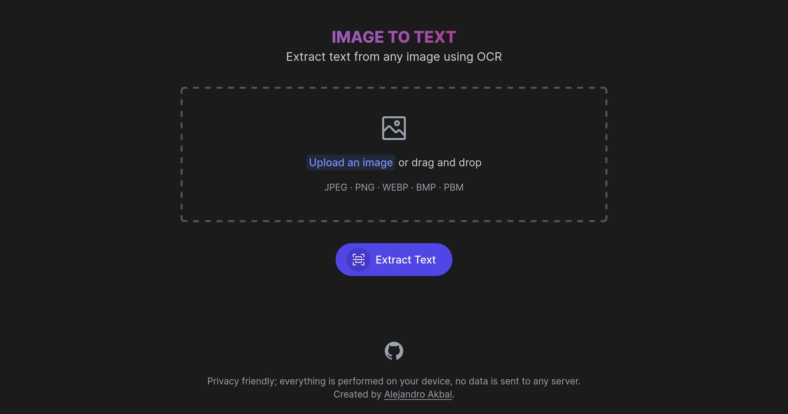

<p align='center'>
  
</p>

<h1 align='center'>
Image to Text OCR
</h1>

[Image to Text OCR](https://image-to-text-ocr.netlify.app) is a utility website made by [Alejandro Akbal](https://akbal.dev)
for extracting text from any image using OCR.

This tool was made for those moments where you take a photo of some text and wish you could have it digitally.



## Usage

### Development

Just run and visit <http://localhost:3000>

```bash
pnpm dev
```

### Build

To build the App, run

```bash
pnpm build
```

And you will see the generated files in `dist` that are ready to be served.
